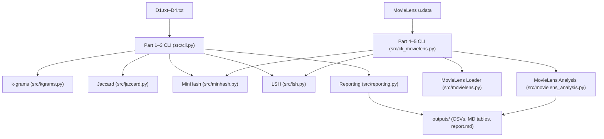

# CSL7110 Assignment 2: MinHash and LSH (Parts 1–5)

This repo contains a clean, modular Python implementation for CSL7110 Assignment 2. It covers k-grams, Jaccard similarity, MinHash, and LSH for the D1–D4 toy documents (Parts 1–3) and MovieLens 100k (Parts 4–5). The code is structured for readability, repeatability, and easy reporting.

**Tech Stack**
- Python 3.10+: Core implementation, CLI, and tests.
- NumPy: Efficient signature handling for MovieLens and fast pairwise comparisons.

Why this stack
- Python provides fast iteration for algorithmic assignments and clear readability.
- NumPy is used only where array operations are performance-critical (MovieLens signatures).

**Folder Structure**
```
.
├── data
│   ├── minhash
│   │   ├── D1.txt
│   │   ├── D2.txt
│   │   ├── D3.txt
│   │   └── D4.txt
│   └── movielens
│       └── ml-100k
│           └── u.data
├── outputs
│   ├── part1_kgrams_jaccard.csv
│   ├── part2_minhash_d1_d2.csv
│   ├── part2_t_recommendation.txt
│   ├── part3_lsh_params.txt
│   ├── part3_lsh_probabilities.csv
│   ├── part4_exact_pairs_ge_0_5.csv
│   ├── part4_minhash_pairs_t50_run1.csv
│   ├── part4_minhash_pairs_t100_run1.csv
│   ├── part4_minhash_pairs_t200_run1.csv
│   ├── part4_minhash_summary.csv
│   ├── part5_lsh_summary_tau_0.6.csv
│   ├── part5_lsh_summary_tau_0.8.csv
│   ├── part5_lsh_candidates_tau_0.6_t*_r*_b*_run1.csv
│   ├── part5_lsh_candidates_tau_0.8_t*_r*_b*_run1.csv
│   ├── *.md
│   └── report.md
├── src
├── tests
└── README.md
```

**Architecture Diagram**


**Code Structure**
- `src/cli.py`: Parts 1–3 CLI runner for D1–D4.
- `src/cli_movielens.py`: Parts 4–5 CLI runner for MovieLens.
- `src/kgrams.py`: Character and word k-gram construction.
- `src/jaccard.py`: Jaccard similarity.
- `src/minhash.py`: MinHash hash family and signatures.
- `src/lsh.py`: LSH probability and parameter utilities.
- `src/movielens.py`: MovieLens `u.data` loader.
- `src/movielens_analysis.py`: Exact Jaccard, MinHash estimates, LSH candidates, FP/FN.
- `src/format_outputs.py`: Converts CSV outputs into Markdown tables and bundles a report.
- `src/config.py`: All constants and parameters in one place.

**How to Run**
All commands are run from the repo root.

Part 1–3 (D1–D4)
```
python -m src.cli
```
This prints results to the terminal for screenshots and writes CSVs into `outputs/`.

Part 4–5 (MovieLens 100k)
```
python -m src.cli_movielens --ratings-path data/movielens/ml-100k/u.data --print-limit 10
```
- `--print-limit 10` is screenshot-friendly for large tables.
- Use `--print-limit 0` to print all rows.

Format outputs as Markdown tables
```
python -m src.format_outputs --bundle
```
This creates `outputs/report.md` which you can paste into your PDF or convert to PDF.

Include LSH candidate tables in the bundle
```
python -m src.format_outputs --bundle --include-candidates
```

**How to Read the Code**
Start here in order:
1. `src/config.py` for all assignment parameters.
2. `src/cli.py` for Parts 1–3 workflow.
3. `src/cli_movielens.py` for Parts 4–5 workflow.
4. Algorithm modules: `kgrams.py`, `jaccard.py`, `minhash.py`, `lsh.py`.
5. MovieLens logic: `movielens.py`, `movielens_analysis.py`.

Each module is single-purpose and fully typed. Docstrings explain assumptions and behavior.

**Key Parameters (from assignment)**
- MinHash range size: `m = 10007` (must be > 10,000).
- Part 2 t-values: 20, 60, 150, 300, 600.
- Part 3 LSH: `t = 160`, `tau = 0.7`.
- Part 5 LSH configs (fixed):
  - `t=50, r=5, b=10`
  - `t=100, r=5, b=20`
  - `t=200, r=5, b=40`
  - `t=200, r=10, b=20`
  - Same configs for `tau = 0.6` and `tau = 0.8`.

**Results Summary and Analysis**
Part 1–3 (D1–D4)
- D1 and D2 are the most similar across all k-gram types.
- 3-gram Jaccard for D1–D2 is very high at `0.977979`, showing near-duplicate content.
- Word 2-grams produce much lower similarities for D1–D3/D4, reflecting token-level divergence.

Part 2 (MinHash on D1 vs D2, 3-grams)
- Exact Jaccard = `0.977979`.
- MinHash estimates converge quickly; `t=150` gives low error with minimal extra time.
- Beyond `t=150`, error improvement is marginal, so `t=150` is a good tradeoff.

Part 3 (LSH on D1–D4)
- Using `t=160` and `tau=0.7`, the best `(r,b)` found is `r=16, b=10`.
- Candidate probabilities are high for D1–D2 and near zero for low-similarity pairs, as expected.

Part 4 (MovieLens exact Jaccard)
- Total user pairs: 444,153.
- Only 10 pairs have Jaccard >= 0.5, showing strong sparsity in shared movie sets.

Part 4 (MovieLens MinHash)
- Average FP/FN over 5 runs:
  - `t=50`: FP 87.80, FN 3.40
  - `t=100`: FP 20.00, FN 2.60
  - `t=200`: FP 7.80, FN 2.40
- Larger `t` reduces false positives, with diminishing returns after `t=100`.

Part 5 (MovieLens LSH, fixed configs)
- `tau=0.6` summary:
  - `t=50, r=5, b=10`: FP 0.60, FN 2.00
  - `t=100, r=5, b=20`: FP 0.00, FN 3.00
  - `t=200, r=5, b=40`: FP 0.00, FN 2.80
  - `t=200, r=10, b=20`: FP 0.00, FN 2.40
- `tau=0.8` summary:
  - `t=50, r=5, b=10`: FP 0.60, FN 0.00
  - `t=100, r=5, b=20`: FP 0.00, FN 1.00
  - `t=200, r=5, b=40`: FP 0.00, FN 0.80
  - `t=200, r=10, b=20`: FP 0.00, FN 0.40

Interpretation
- Increasing `t` generally reduces FP and FN, but returns diminish.
- Stricter threshold `tau=0.8` reduces FN in some configs, but candidate counts drop sharply.
- Fixed configs show that `t=200, r=10, b=20` gives the most balanced behavior among the provided options.

**Testing**
Tests are in `tests/` and cover all modules. If pytest is installed:
```
python -m pytest -q
```

**Reproducibility**
- Default seed is 42.
- All MinHash runs use fixed seeds for repeatable results.

**Notes**
- Outputs are written to `outputs/` for easy inclusion in your PDF report.
- Use the CLI terminal output for screenshots as required by the assignment.
